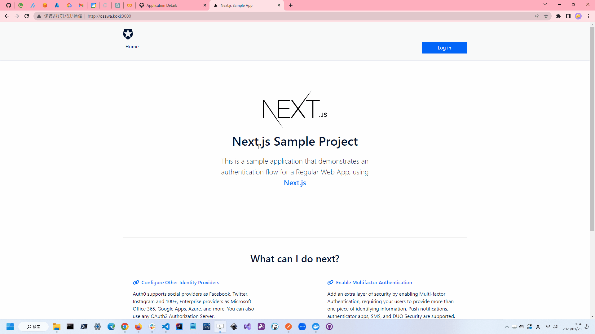
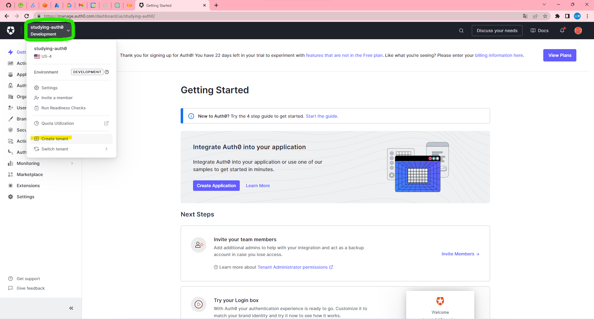
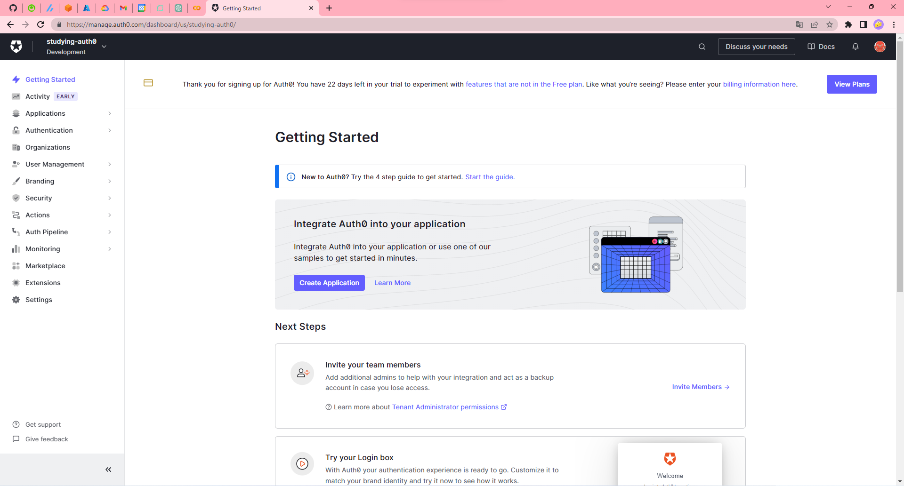

# studying-auth0

🔏🔏🔏 IDaaSプロバイダ大手、Auth0について学習する。  
料金が個人で使用するには高すぎる気が、、、  

  

## イロイロ説明

### Auth0とは

Auth0は、認証、認可、ユーザ管理、多要素認証、アクセス管理、アプリケーションの監視、分析、統合などを提供するIDaaSプロバイダです。  
認証に関するイロイロな機能を提供してくれるので、認証周りの実装をする必要がなくなります。  
また、認証周りの実装をするとなると、セキュリティ面での対策が必要になるので、それらの対策をしなくてもよくなります。  

システムの簡素化・セキュリティの強化・開発の効率化ができるので、開発者にとってはとても便利なサービスです。  

似たようなサービスとしては、Firebase Authenticationがあります。  

## 実装方法

### 0.目次

1. Auth0のアカウント作成
2. テナントの作成
3. アプリケーションの作成
4. アプリケーションの設定
5. URIの設定

### 1. Auth0のアカウント作成

まずは、Auth0のアカウントを作成します。  
<https://auth0.com/>  

個人であれば、無料プランで使用することができます。  

### 2.テナントの作成

次に、テナントを作成します。  

テナントとはアプリケーションを管理するための単位です。  
また、組織の単位としても使えます。  

テナントを作成するには、ダッシュボードの左上に表示されている現在のテナントをクリックし、「Create Tenant」をクリックします。  

  

### 3.アプリケーションの作成

次に、アプリケーションを作成します。  

アプリケーションとは、認証を行うアプリケーションのことです。  
左上のログをクリックして、トップページへ進み、「Create Application」をクリックします。  

  

### 4.アプリケーションの設定

アプリケーションの設定画面へ進み、以下の内容を保存します。  

- Domain
- Client ID
- Client Secret

これらを`.env.local.example`にバリューにセットします。  
同時に、`.env.local.example`を`.env.local`にリネームします。  

### 5. URIの設定

アプリケーションの設定画面の「Allowed Callback URLs」に、`http://localhost:3000/api/auth/callback/auth0`を追加します。  
また、「Allowed Logout URLs」に、`http://localhost:3000/`を追加します。  

## 参考文献

- [Auth0](https://auth0.com/)
- [使用したテンプレート](https://github.com/auth0-samples/auth0-nextjs-samples)
- [テンプレート一覧](https://github.com/orgs/auth0-samples/repositories)

## 補足

Next.jsのTypeScriptのサンプルは無かった、、、  
